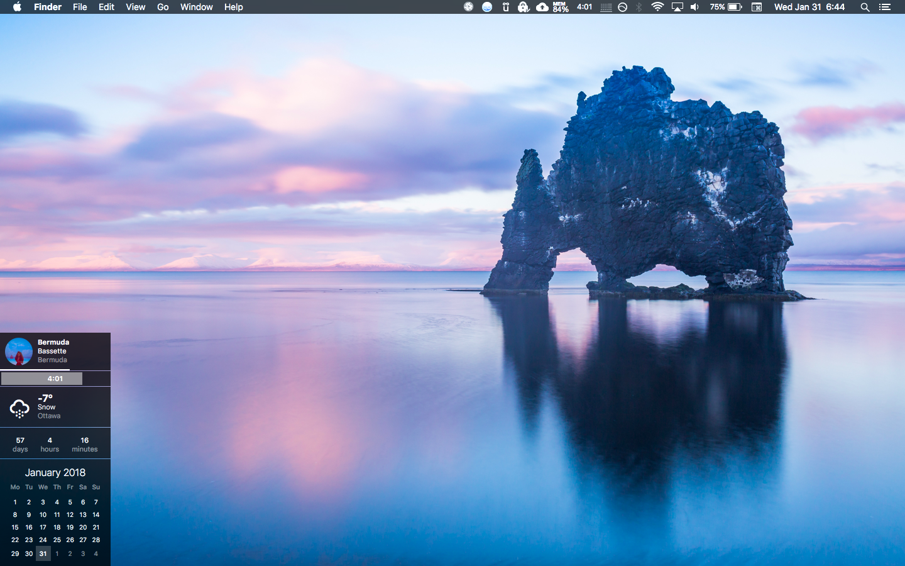

# Sidebar for [Übersicht](http://tracesof.net/uebersicht/)



A multi-widget containing:
- Playbox with iTunes and Spotify support (hides dynamically)
- Battery monitor
- Weather
- Time elapsed from an event counter
- 2x world clock
- Time until next calendar event (uses [icalbuddy](http://hasseg.org/icalBuddy/), hides dynamically)
- Calendar

It supports flex positioning, easy background blur and tons of probably very poorly written code.

## Options

Each widget provides an easy way to toggle its visibility. Look at the top of respective widget's `index.coffee`:

```
options =
  # Easily enable or disable the widget.
  widgetEnable: true
```
